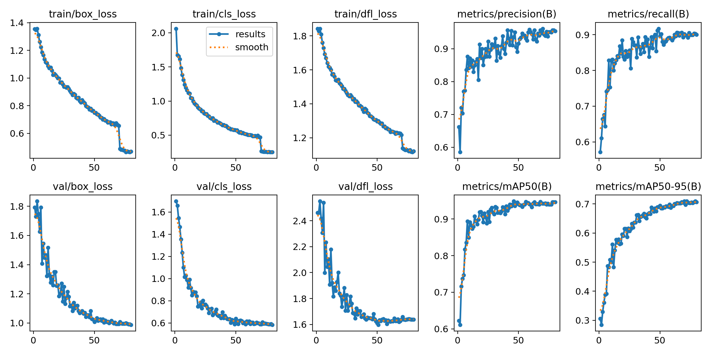
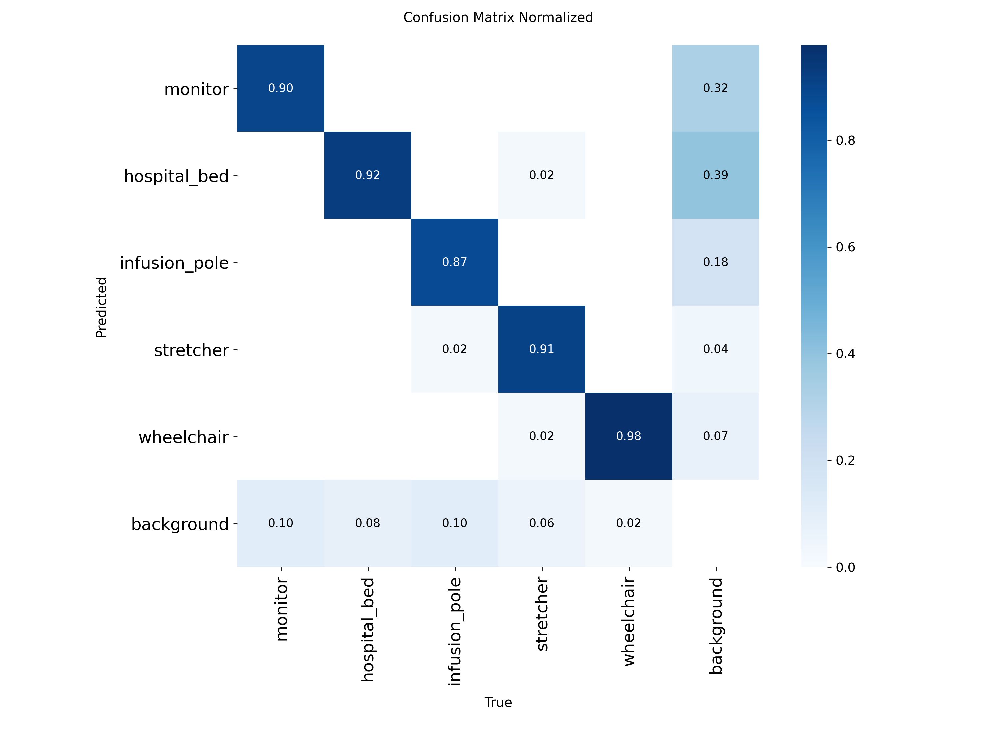
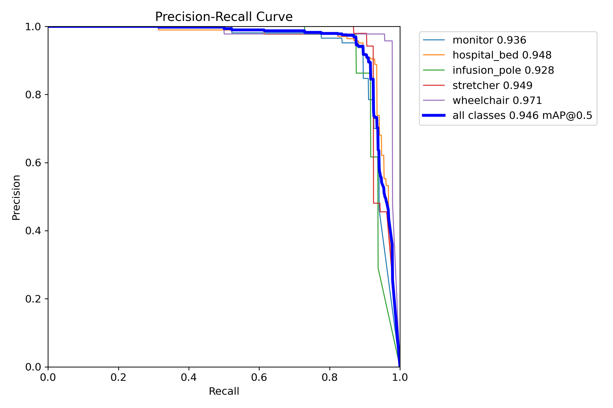
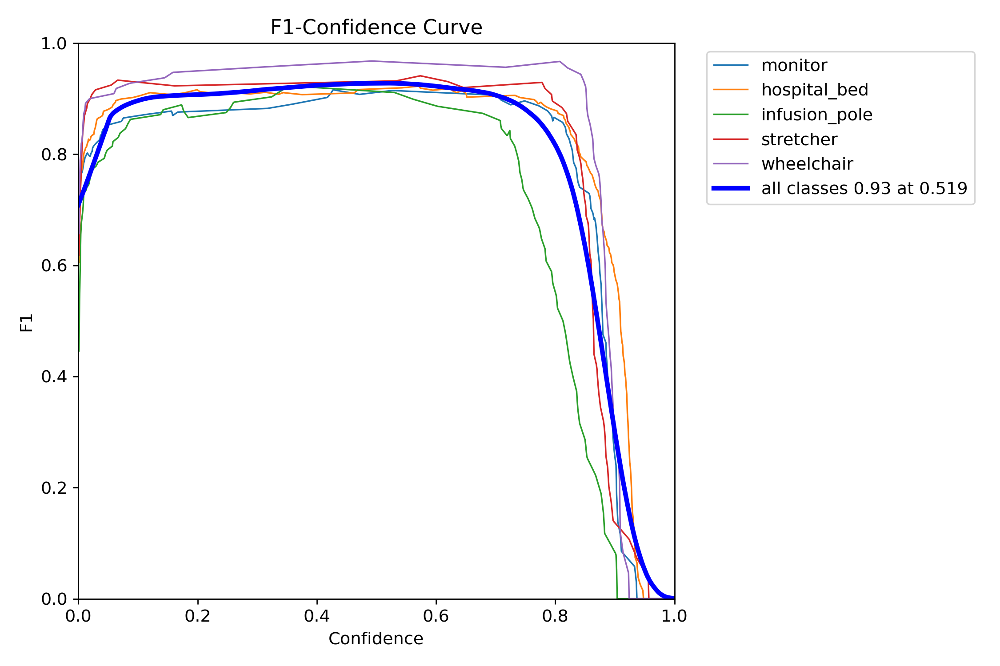

<div align="center">

# MediScan AI

**AI-Powered Medical Equipment Detection**

[](https://python.org)
[](https://streamlit.io)
[](https://docs.ultralytics.com)
[](https://pytorch.org)
[](https://creativecommons.org/licenses/by/4.0/)
[](https://github.com/cvzone/cvzone)

An object detection system built to identify and track medical equipment in hospital environments using YOLOv8, Streamlit, and cvzone.

</div>

---

## About

MediScan AI detects medical equipment from images and video feeds. It uses custom-trained YOLOv8 models to recognize 5 classes of hospital equipment and provides structured detection summaries, equipment checklists, and room health assessments.

This is a **demo project** and is not intended for clinical use.

---

## Features

- **Image Detection** - Upload single or multiple images, get annotated results with corner-rectangle overlays
- **Video Detection** - Process `.mp4` files with ByteTrack object tracking and live frame streaming
- **cvzone Corner Rectangles** - Clean, professional bounding box style with per-class color coding
- **Detection Summary** - Total detections, per-class counts, confidence breakdowns, and low-confidence alerts
- **Room Assessment** (Video) - Weighted scoring system to evaluate room equipment setup
- **Equipment Checklist** - Tracks which expected equipment is present or missing
- **Model Selection** - Switch between Nano (fast), Small (accurate), and Medium (balanced) YOLOv8 variants
- **GPU Support** - Automatic CUDA detection with CPU fallback
- **Adjustable Thresholds** - Tunable confidence and IOU sliders

---

## Detected Classes

| Class | Priority |
|-------|----------|
| `hospital_bed` | Critical |
| `monitor` | Critical |
| `infusion_pole` | Important |
| `stretcher` | Supplementary |
| `wheelchair` | Supplementary |

---

## Project Structure

```
mediscan_ai/
├── app.py                  # Streamlit application (main entry point)
├── config.ini              # Model paths configuration
├── requirements.txt        # Python dependencies
├── pyproject.toml
│
├── core/
│   ├── detector.py         # Detection + cvzone drawing logic
│   ├── analyzer.py         # Summary, equipment checklist, room assessment
│   ├── model.py            # Model loading (reads from config.ini)
│   ├── Video_process.py    # Video processing with ByteTrack tracking
│   └── style.css           # Custom Streamlit styling
│
├── models/
│   ├── yolov8n/            # Nano model weights + training artifacts
│   │   ├── best.pt
│   │   └── exp1/           # Training curves, confusion matrix, results
│   ├── yolov8s/            # Small model weights + training artifacts
│   │   ├── best.pt
│   │   └── exp1/
│   └── yolov8m/            # Medium model weights + training artifacts
│       ├── best.pt
│       └── exp1/
│
└── assets/
    ├── logo.png
    ├── favicon.png
    └── data/               # Dataset configuration
```

---

## Training Details

All models were trained on a custom hospital equipment dataset sourced from [Roboflow](https://app.roboflow.com/parmthenoob/hospital-scb9f-dd7gs/6) with 5 classes.

### Nano Model (YOLOv8n)

| Parameter | Value |
|-----------|-------|
| Base Model | `yolov8n.pt` (pretrained) |
| Epochs | 80 |
| Batch Size | 16 |
| Image Size | 640x640 |
| Optimizer | Auto |

**Final Metrics:**

| Metric | Value |
|--------|-------|
| mAP50 | 93.56% |
| mAP50-95 | 68.63% |
| Precision | 92.59% |
| Recall | 88.07% |

### Small Model (YOLOv8s)

| Parameter | Value |
|-----------|-------|
| Base Model | `yolov8s.pt` (pretrained) |
| Epochs | 80 |
| Patience | 30 |
| Batch Size | 8 |
| Image Size | 640x640 |
| Optimizer | Auto |
| Cosine LR | Enabled |

**Final Metrics:**

| Metric | Value |
|--------|-------|
| mAP50 | 94.61% |
| mAP50-95 | 70.67% |
| Precision | 95.36% |
| Recall | 90.03% |

### Medium Model (YOLOv8m)

| Parameter | Value |
|-----------|-------|
| Base Model | `yolov8m.pt` (pretrained) |
| Epochs | 80 |
| Patience | 30 |
| Batch Size | 8 |
| Image Size | 640x640 |
| Optimizer | Auto |
| Cosine LR | Enabled |

**Best Validation Metrics (exp1):**

| Metric | Value |
|--------|-------|
| mAP50 | 94.91% |
| mAP50-95 | 71.64% |
| Precision | 94.68% |
| Recall | 89.00% |

### Training Curves and Confusion Matrix

Training artifacts are available under `models/yolov8n/exp1/`, `models/yolov8s/exp1/`, and `models/yolov8m/exp1/`:

**Results (Small Model):**

<div align="center">

</div>

**Confusion Matrix (Small Model):**

<div align="center">

</div>

**Precision-Recall Curve (Small Model):**

<div align="center">

</div>

**F1 Curve (Small Model):**

<div align="center">

</div>

**Validation Predictions (Small Model):**

<div align="center">

</div>

---

## Installation

```bash
# Clone the repo
git clone https://github.com/xXParm06Xx/MediScan-AI.git
cd mediscan-ai

# Create virtual environment
python -m venv .venv
.venv\Scripts\activate    # Windows
# source .venv/bin/activate  # Linux/Mac

# Install dependencies
pip install -r requirements.txt
```

---

## Usage

```bash
streamlit run app.py
```

1. Open the app in your browser (default: `http://localhost:8501`)
2. Select a model from the sidebar
3. Adjust confidence and IOU thresholds if needed
4. Navigate to **Detection** page
5. Upload images or video and click **Detect**

---

## Tech Stack

| Component | Technology |
|-----------|-----------|
| Frontend | Streamlit |
| Object Detection | YOLOv8 (Ultralytics) |
| Deep Learning | PyTorch |
| Image Processing | OpenCV, Pillow |
| Bounding Boxes | cvzone |
| Object Tracking | ByteTrack |
| Config | configparser |

---

## Dataset

- **Source:** [Roboflow](https://app.roboflow.com/parmthenoob/hospital-scb9f-dd7gs/6)
- **Classes:** 5 (monitor, hospital_bed, infusion_pole, stretcher, wheelchair)
- **License:** CC BY 4.0

---

## Limitations

- Only detects the 5 trained equipment classes
- Detection quality depends on image resolution and lighting
- Not certified or validated for clinical deployment
- The Nano model was trained on an older class set (8 classes) - Small and Medium use the current 5-class setup

---

## License

Dataset licensed under [CC BY 4.0](https://creativecommons.org/licenses/by/4.0/).
